 # 用例 UI设计
-----
## 用户点餐UI设计

用户点餐模块我们选择在手机端实现

### 1. 点餐模块

####1.1 菜单主页界面

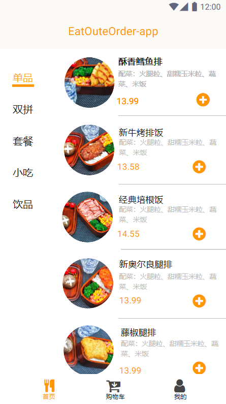
####1.2 餐品详情界面

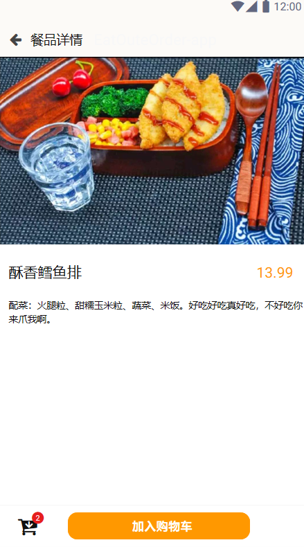

###2. 购物车模块

####2.1 购物车界面

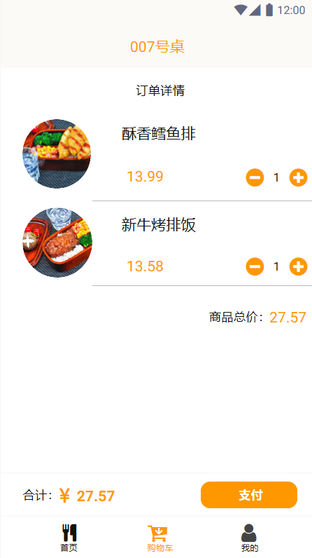
####2.2 支付成功界面

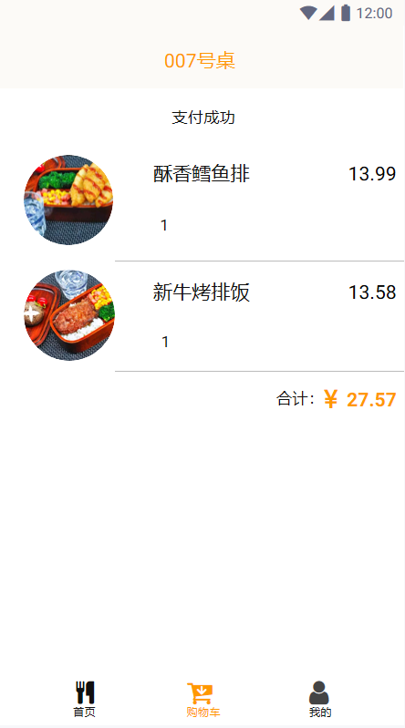

###3. 个人信息功能

####3.1 用户界面

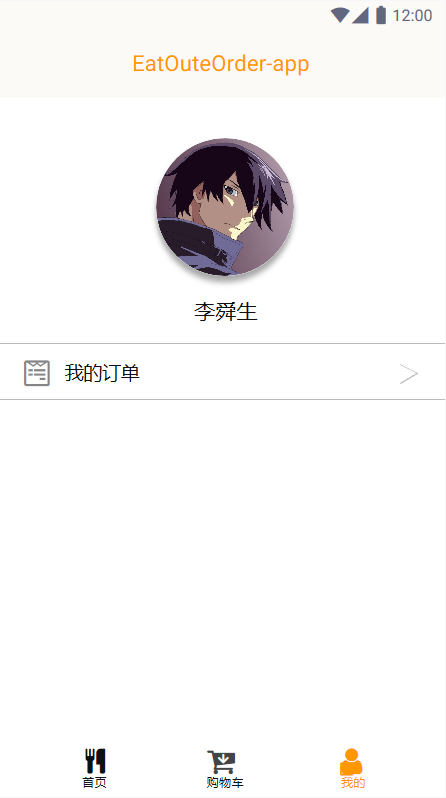
####3.2 历史订单界面

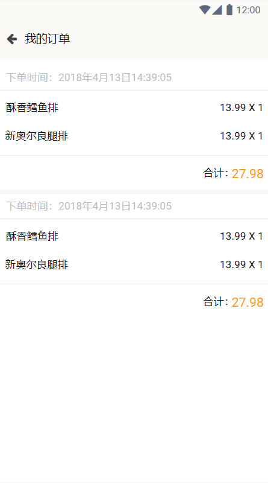

##商户端UI设计

###未登录时主页

###登录页面

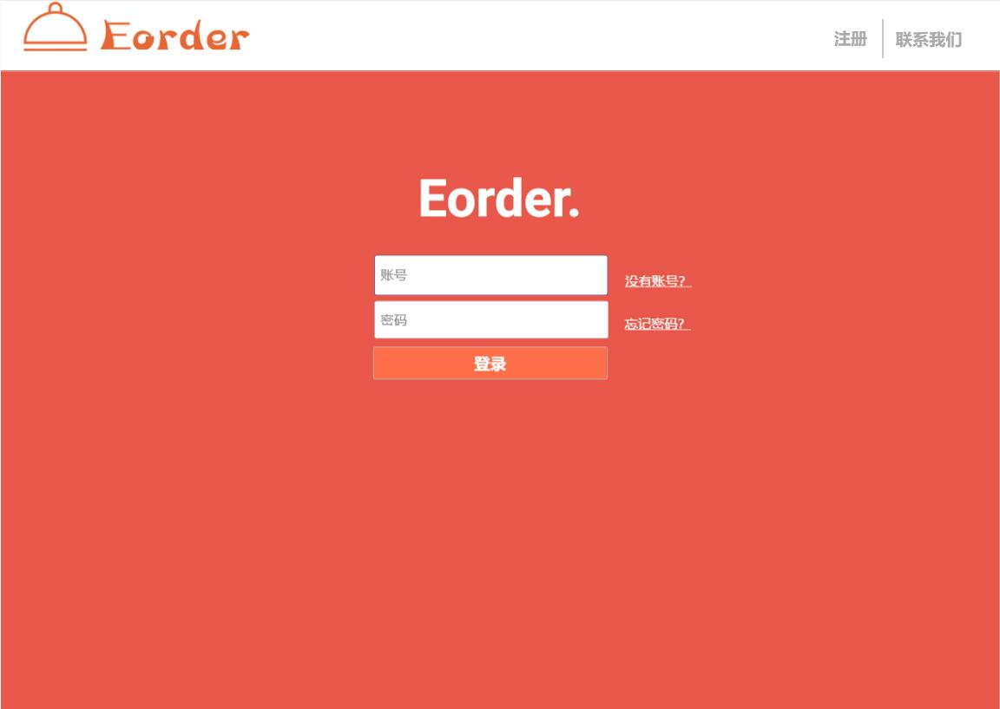

### 注册页面

注册页面分为几个页面

#### 页面1

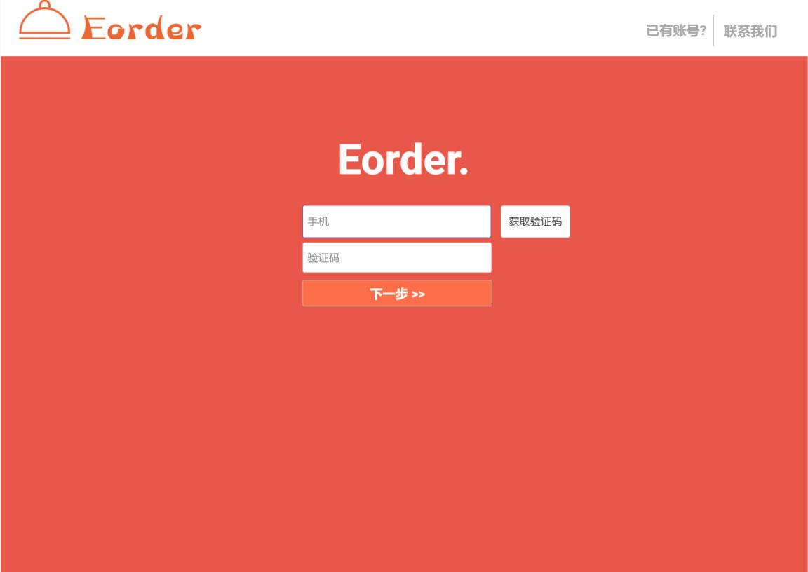

#### 页面2

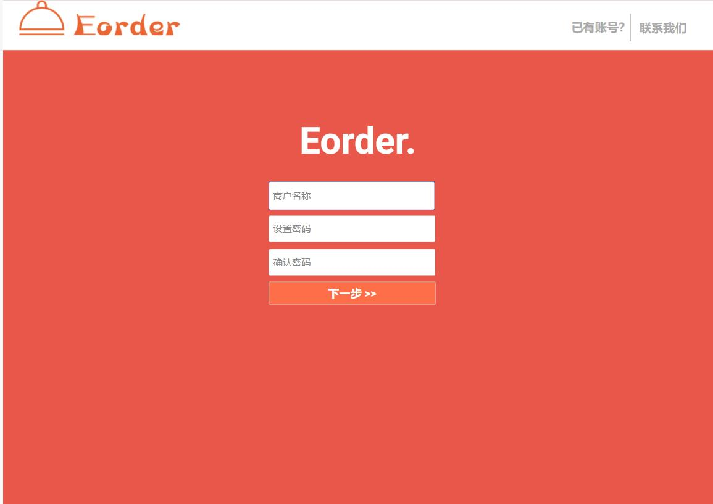

#### 页面3

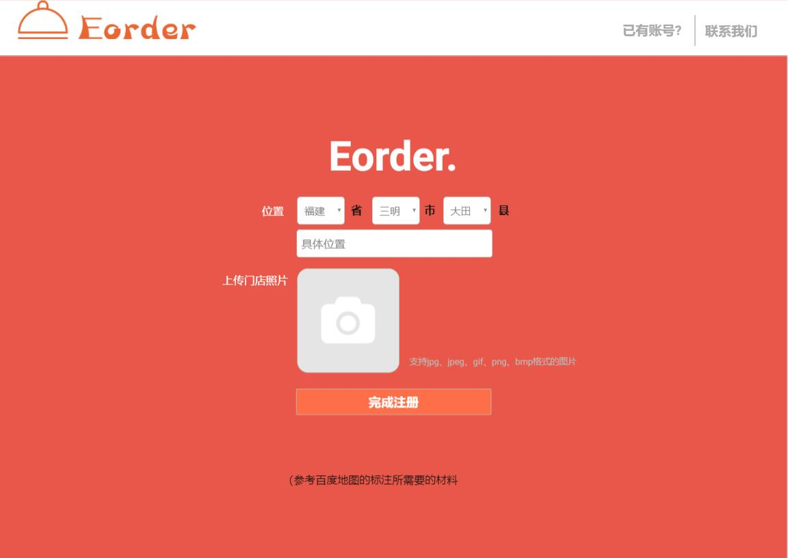

### 登录后主页

和未登录相比，页面左上角多了一个打招呼的语句

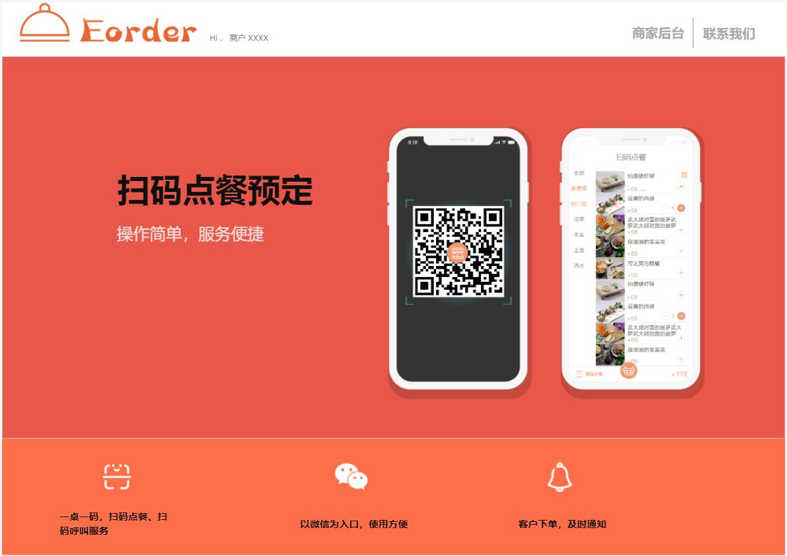

###后台页面

登录后可以跳转至后台页面

#### 后台首页-商户中心

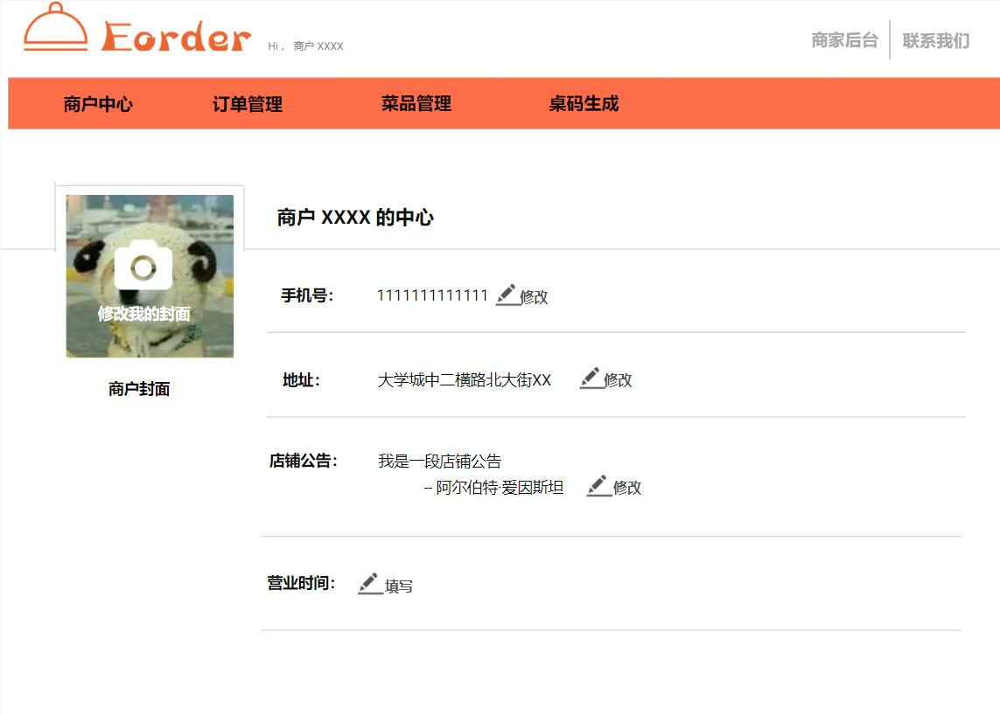

####订单管理页面

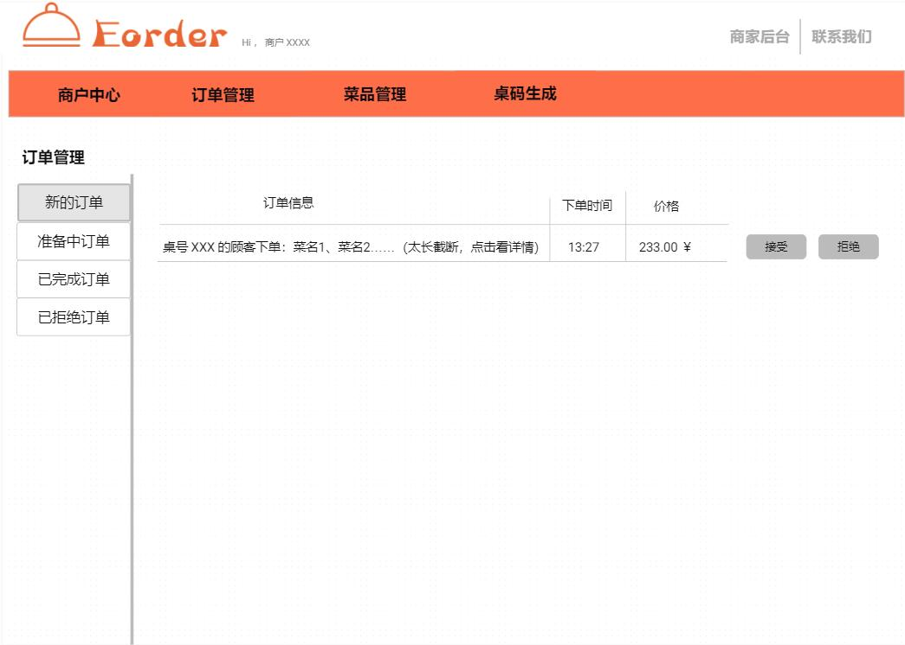

####  桌码生成页面

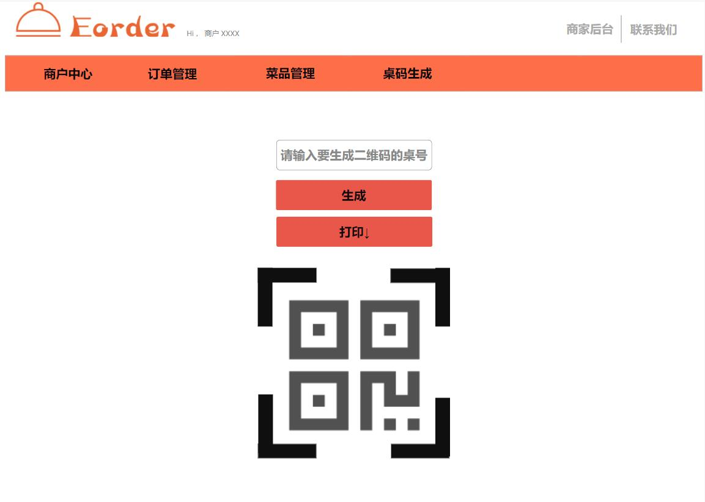

#### 菜品管理

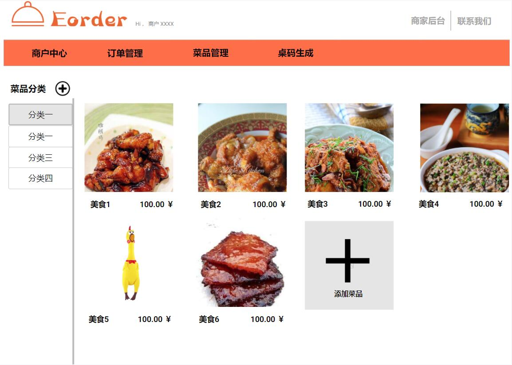

点击菜品大图可以进入修改或者删除菜品信息

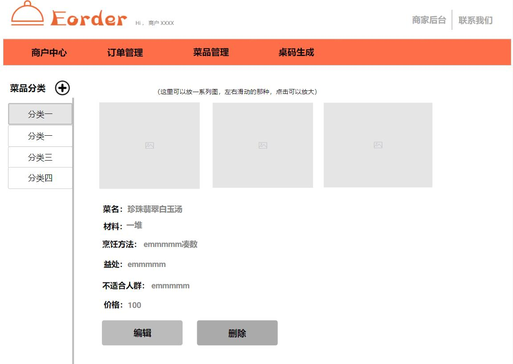

 

---

