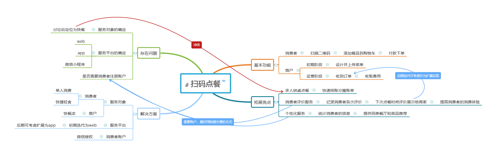
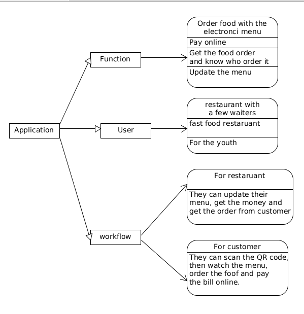
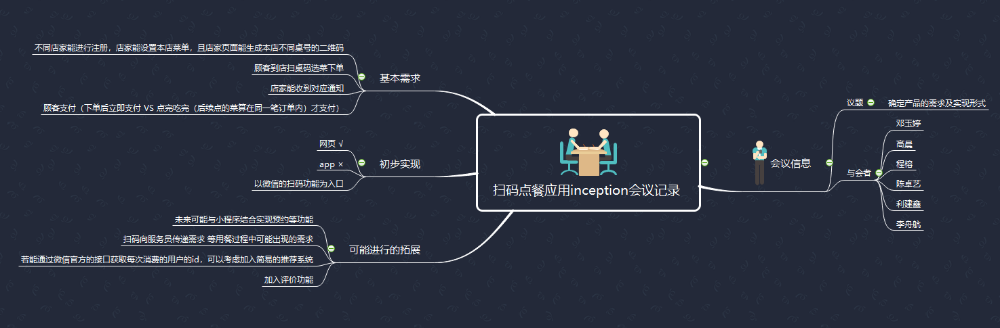
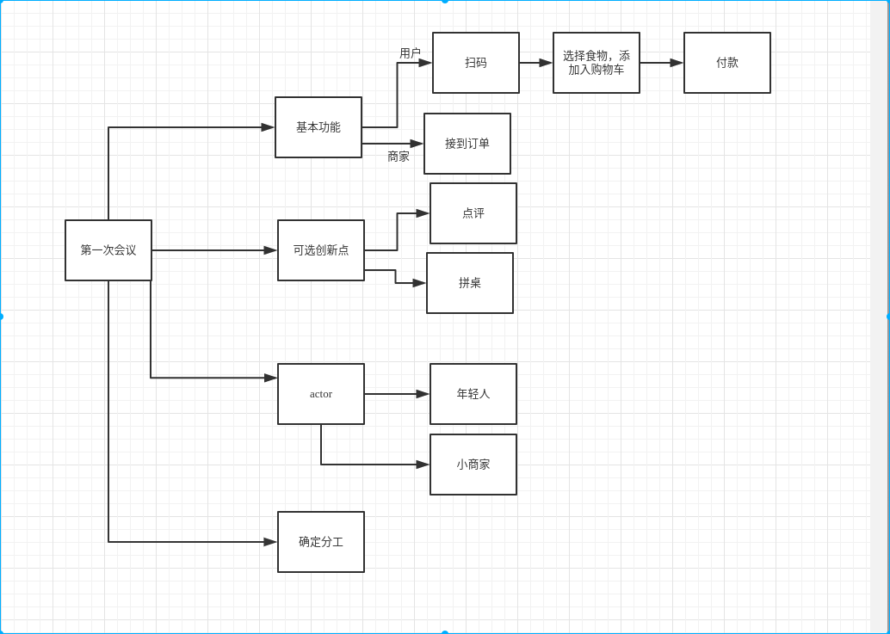

# Inception会议记录
2018年3月26日 16:00 - 17:00
* 会议目标：定义产品范围、愿景和核心业务
* 会议任务：
    * 介绍产品调查结果
    * 产品讨论
    * 定义产品
    * 分析涉及的相关技术与潜在风险
    * 项目经理总结陈词
* 个人任务：记录会议“思维导图”拍照，作为你项目技术报告的一部分。请在现场，使用 “思维导图” 导图记录目标达成的过程。 用重点标识符勾出你认为（贡献人含自己）最有价值的要点与冲突。（肯定别人提议，凝练议题要点，群面必杀之技）。
* 创新点凝练：

## 记录会议“思维导图”

**by：Tempo**

**by：Joey**

**by：Rong Cheng**

**by：Jianxin Li**

**by：Tango**

**by：Robin**

# Iteration1会议记录
2018年4月14日 19:00 - 20:00

* 会议目标：明确部分功能细节，总结本次迭代，讨论下一次迭代
* 会议任务：
    * 确定用户登录，讨论商户端设计
    * 讨论团队作业
    * 报告各自工作进展，确定技术框架
    * 讨论问卷调查结果
    * 确定下一次迭代目标
* 个人任务：明确自己接下来的任务，完成分配的任务，编写各自的技术学习报告。
